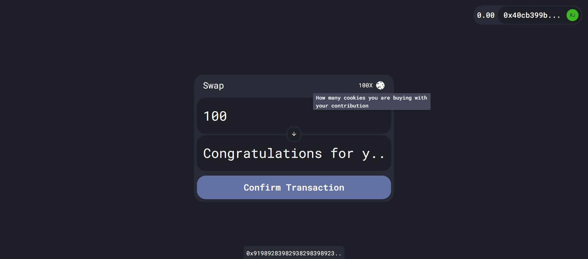

<div id="top"></div>

<!-- PROJECT SHIELDS -->
<!--
*** I'm using markdown "reference style" links for readability.
*** Reference links are enclosed in brackets [ ] instead of parentheses ( ).
*** See the bottom of this document for the declaration of the reference variables
*** for contributors-url, forks-url, etc. This is an optional, concise syntax you may use.
*** https://www.markdownguide.org/basic-syntax/#reference-style-links
-->
<!-- PROJECT LOGO -->
<br />
<div align="center">
  

  <h3 align="center">buymeacookie</h3>

  <p align="center">
    A crowd funding application made with Solidity, Hardhat, Next.JS, Prisma.io and Ethers.JS.
    <br />
    <a href="https://github.com/robertokbr/buymeacookie"><strong>Explore the docs »</strong></a>
    <br />
    <br />
    <a href="https://buy-me-a-cookie.rbjr.dev">View Demo</a>
    ·
    <a href="https://github.com/robertokbr/buymeacookie/issues">Report Bug</a>
    ·
    <a href="https://github.com/robertokbr/buymeacookie/issues">Request Feature</a>
  </p>
</div>

<!-- ABOUT THE PROJECT -->
## About The Project

[![Contributors][contributors-shield]][contributors-url]
[![Forks][forks-shield]][forks-url]
[![Stargazers][stars-shield]][stars-url]
[![Issues][issues-shield]][issues-url]
[![LinkedIn][linkedin-shield]][linkedin-url]




Buymeacookie is a dApp that uses the Ethereum blockchain as the core infrastructure to handle donations and give credit to donors. It has been made on top of the app Fund Me, created by Patrick Collins in his [Blockchain, Solidity, and Full Stack Web3 Development with JavaScript – 32-Hour Course, a free course](https://www.youtube.com/watch?v=gyMwXuJrbJQ&t=48465s), powered by freeCodeCamp.org.
The usability of it was inspired by the app [buymeacoffee](https://www.buymeacoffee.com/), which is a content creator support application. 

### Built With
* [Next.js](https://nextjs.org/)
* [Chakra-ui](https://chakra-ui.com/)
* [Hardhat](https://hardhat.org/)
* [Ethers.js](https://www.npmjs.com/package/ethers)
* [Prisma](https://prisma.io)


<!-- GETTING STARTED -->
## Getting Started
To get started wiht the Rinkeby setup, you don't need to deploy the smart contract locally. You'll just need to have a MetaMask installed and the Rinkeby network configured.

### Installation
1. Clone the repo
   ```sh
   git clone https://github.com/robertokbr/buymeacookie.git
   ```
2. Run the docker-compose postgres database
   ```sh
   docker-compose up -d
   ``` 
3. Install npm packages
   ```sh
   cd frontend && npm install
   ```
4. Copy envs
   ```sh
   cp .env.example .env
   ```
5. Run prisma migrations
   ```sh
   npm run prisma migrate dev
   ```   
6. Run frontend
   ```sh
   npm run dev
   ```   

<!-- USAGE EXAMPLES -->
## Usage
To use it, open your browser and head to the address `http://localhost:3000`. 
If you do not have MetaMask installed, go to [MetaMask website](https://metamask.io)/ to install.
In case you already have this installed, change your network to Rinkeby. 

<!-- ROADMAP -->
## Roadmap

### Solidity
- [x] Libraries;
- [x] Modifiers;
- [x] Fallback and Receive functions;
- [x] Constant and immutable properties;
- [x] Payable functions;
- [x] Receive and Fallback functions;
- [x] Storage and Memmory variables;

### Hardhat
- [x] Contract compilation;
- [x] Contract deploy;
- [x] Contract Tests;
- [x] Hardhat Tasks;
- [x] Etherscan verification
- [x] Gas reporter;
- [x] Solidity coverage;
- [x] Typechain
- [x] Unit tests
- [x] Mocks


See the [open issues](https://github.com/robertokbr/buymeacookie/issues) for a full list of proposed features (and known issues).


<!-- CONTRIBUTING -->
## Contributing

Contributions are what make the open source community such an amazing place to learn, inspire, and create. Any contributions you make are **greatly appreciated**.

If you have a suggestion that would make this better, please fork the repo and create a pull request. You can also simply open an issue with the tag "enhancement".
Don't forget to give the project a star! Thanks again!

1. Fork the Project
2. Create your Feature Branch (`git checkout -b feature/AmazingFeature`)
3. Commit your Changes (`git commit -m 'Add some AmazingFeature'`)
4. Push to the Branch (`git push origin feature/AmazingFeature`)
5. Open a Pull Request


<!-- LICENSE -->
## License

Distributed under the MIT License. See `LICENSE.txt` for more information.


<!-- CONTACT -->
## Contact

Roberto Junior - [@robertojrdev](https://twitter.com/robertojrdev) - robertojuniordev@gmail.com


<!-- ACKNOWLEDGMENTS -->
## Acknowledgments
This app backend (smart contract) was made following the resource bellow:

* [Learn Blockchain, Solidity, and Full Stack Web3 Development with JavaScript – 32-Hour Course](https://www.youtube.com/watch?v=gyMwXuJrbJQ&t=46910s)


<!-- MARKDOWN LINKS & IMAGES -->
<!-- https://www.markdownguide.org/basic-syntax/#reference-style-links -->
[contributors-shield]: https://img.shields.io/github/contributors/robertokbr/buymeacookie.svg?style=for-the-badge
[contributors-url]: https://github.com/robertokbr/buymeacookie/graphs/contributors
[forks-shield]: https://img.shields.io/github/forks/robertokbr/buymeacookie.svg?style=for-the-badge
[forks-url]: https://github.com/robertokbr/buymeacookie/network/members
[stars-shield]: https://img.shields.io/github/stars/robertokbr/buymeacookie.svg?style=for-the-badge
[stars-url]: https://github.com/robertokbr/buymeacookie/stargazers
[issues-shield]: https://img.shields.io/github/issues/robertokbr/buymeacookie.svg?style=for-the-badge
[issues-url]: https://github.com/robertokbr/buymeacookie/issues
[license-shield]: https://img.shields.io/github/license/robertokbr/buymeacookie.svg?style=for-the-badge
[license-url]: https://github.com/robertokbr/buymeacookie/blob/main/LICENSE.txt
[linkedin-shield]: https://img.shields.io/badge/-LinkedIn-black.svg?style=for-the-badge&logo=linkedin&colorB=555
[linkedin-url]: https://www.linkedin.com/in/robertojrcdc/
[product-screenshot]: images/screenshot.png
